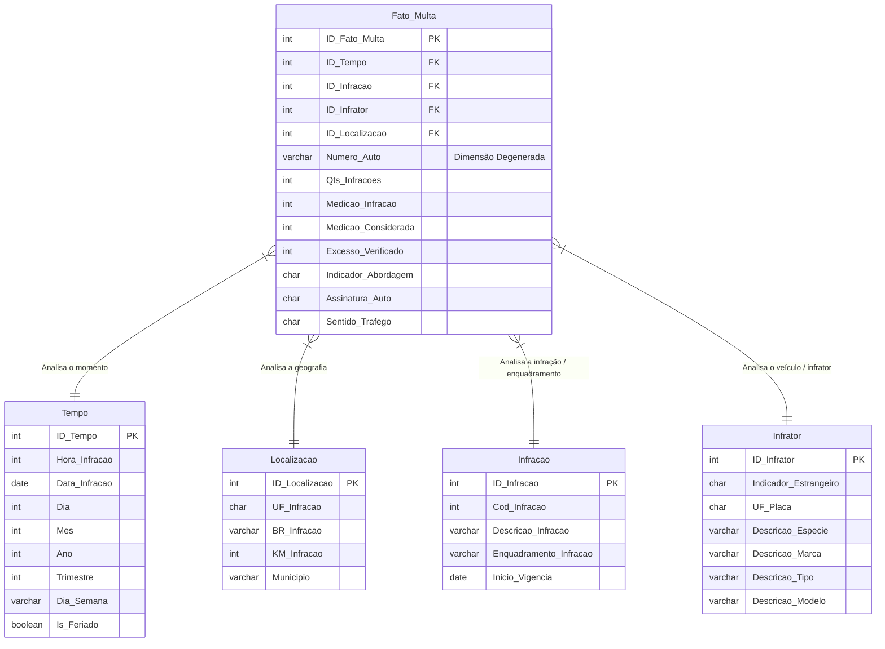

# Projeto de Integração: Análise de Dados da PRF (2022–2024)

[](https://www.postgresql.org/)
[](https://www.getdbt.com/)
[](https://www.python.org/)
[](https://colab.research.google.com/)

Este repositório contém o projeto de integração de dados da **Polícia Rodoviária Federal (PRF)**, consolidando informações sobre infrações de trânsito em âmbito nacional nos anos de **2022**, **2023** e **2024**. 

O objetivo central do projeto é a concepção de um ecossistema analítico completo, iniciando na extração dos microdados brutos (mais de 14 milhões de autuações), passando pelo carregamento em banco de dados relacional (**PostgreSQL**) e transformações via **dbt (Data Build Tool)**, culminando em um **Data Warehouse modelado em Esquema Estrela (Star Schema)** otimizado para consultas complexas e inteligência de dados.

---

## Integrantes

O desenvolvimento deste projeto foi executado colaborativamente pelo **Grupo 6**, na disciplina de *Banco de Dados* no *Projeto de Integração* do **Centro de Informática (CIn - UFPE)**:

* Amanda Trinity
* Mirella Laura
* Maria Eduarda Torres
* Maria Luísa Brandão
* Matheus Braglia
* Willian Rupert

---

## Estrutura do Repositório

O projeto está estruturado de forma modular e seguindo as melhores práticas modernas da engenharia de dados:

```text
├── notebooks/                     # Processos de carga, transformação e modelagem
│   ├── ELT_prf_multas.ipynb       # ELT - Fase E + L: Extração e Carga dos dados brutos
│   ├── ELT_transformacao_prf_multas.ipynb # ELT - Fase T: Transformações dimensionais via SQL puro
│   └── ETL_prf_multas.ipynb       # ETL completo: Extração, Transformação via Pandas e Carga final
│
├── transformacao_prf/             # Projeto dbt para transformações de dados no banco (alternativa de ELT)
│   ├── models/
│   │   ├── staging/               # Limpeza, padronização e tipagem (Luz sobre dados brutos)
│   │   └── marts/                 # Modelos dimensionais finais (Fato e Dimensões)
│   ├── dbt_project.yml            # Configuração geral do projeto dbt
│   └── packages.yml               # Dependências do dbt
│
├── docs/                          # Documentação técnica de apoio
│   └── modelagem_dimensional_e_dicionario_de_dados.md # Dicionário de variáveis e regras de negócio
│
├── analysis/                      # Análises estatísticas, visualizações e relatórios
│   └── .gitkeep
│
└── README.md                      # Documento principal de apresentação
```

---

## Arquitetura do Data Warehouse & Modelagem Dimensional

Para responder perguntas analíticas de alto volume e desempenho (ex: *evolução anual de multas por região*, *correlação de excesso de velocidade por tipo de veículo*), desnormalizamos os dados relacionais em um **Esquema Estrela (Star Schema)**.

### Diagrama Entidade-Relacionamento (Star Schema)

A tabela central `Fato_Multa` liga-se a 4 tabelas de dimensão por meio de chaves substitutas (*surrogate keys*):



>  Para uma descrição detalhada de cada atributo, tipos de dados, chaves substitutas e regras de normalização de inconsistências históricas (como a mudança de tipo do campo `Indicador Veiculo Estrangeiro` em 2024), acesse o [Dicionário de Dados Completo](file:///Users/willian/Projetos/Grupo-6-PRF/docs/modelagem_dimensional_e_dicionario_de_dados.md).

---

## Tecnologias e Paradigmas

O projeto explora e compara ativamente dois paradigmas de ingestão de dados:

1. **ETL (Extract-Transform-Load)**: Os microdados são extraídos dos servidores da PRF, limpos e transformados em memória utilizando **Python (Pandas)** em ambiente **Google Colab**, para somente após a modelagem dimensional serem injetados no PostgreSQL.
2. **ELT (Extract-Load-Transform)**: O notebook `ELT_prf_multas.ipynb` lê os dados brutos de forma restrita (`dtype=str` e sem substituição automática de valores nulos), injetando-os na tabela `raw_multas` do banco. Toda a transformação posterior (higienização, deduplicação e junções para criação de fatos/dimensões) é feita diretamente no **PostgreSQL** por meio de código declarativo no **dbt (Data Build Tool)**.

* **Banco de Dados**: PostgreSQL (Hospedado na nuvem via Neon).
* **Processamento**: SQLAlchemy, PyArrow, Pandas.
* **Orquestração de T.:** dbt Core.

---

## Como Executar o Projeto

### Pré-requisitos
* Python 3.10 ou superior.
* Acesso à internet para conexão com a base de dados PostgreSQL.
* Instalação das dependências Python:
  ```bash
  pip install pandas numpy sqlalchemy psycopg2-binary
  ```
* Arquivos brutos baixados do [Portal de Dados Abertos da PRF](https://www.gov.br/prf/pt-br/acesso-a-informacao/dados-abertos/dados-abertos-da-prf).

### Passo 1: Clone do Repositório
```bash
git clone https://github.com/willianrupert/Grupo-6-PRF.git
cd Grupo-6-PRF
```

### Passo 2: Opção A — Execução via Pipeline ETL (Recomendado para ingestão direta modelada)
Este pipeline realiza todo o processamento de limpeza e modelagem em memória (Pandas) antes de carregar os dados no banco:
1. Abra e execute o notebook [ETL_prf_multas.ipynb](file:///Users/willian/Projetos/Grupo-6-PRF/notebooks/ETL_prf_multas.ipynb).
2. O script fará a leitura incremental dos arquivos CSV, construirá as tabelas dimensionais (`dim_tempo`, `dim_localizacao`, `dim_veiculo`, `dim_infracao`) e a tabela fato (`fato_multa`) aplicando todas as conversões de tipos e normalizações diretamente em Python.
3. As tabelas serão salvas já modeladas e estruturadas no PostgreSQL.

### Passo 2: Opção B — Execução via Pipeline ELT (Carga bruta + Transformação no Banco)
Este pipeline é dividido em duas fases distintas:

#### Fase 1: Extração e Carga (E + L)
1. Abra e execute o notebook [ELT_prf_multas.ipynb](file:///Users/willian/Projetos/Grupo-6-PRF/notebooks/ELT_prf_multas.ipynb).
2. Ele carregará todos os arquivos brutos para a tabela intermediária `raw_multas` como `VARCHAR` puro, sem modificações.

#### Fase 2: Transformação (T)
Você pode executar a transformação do ELT de duas formas alternativas:

* **Via Notebook SQL**: Abra e execute o notebook [ELT_transformacao_prf_multas.ipynb](file:///Users/willian/Projetos/Grupo-6-PRF/notebooks/ELT_transformacao_prf_multas.ipynb). Ele rodará comandos SQL nativos diretamente no PostgreSQL para processar a `raw_multas` e gerar o esquema estrela final.
* **Via dbt (Data Build Tool)**:
  1. Acesse a pasta do dbt:
     ```bash
     cd transformacao_prf
     ```
  2. Instale as dependências:
     ```bash
     dbt deps
     ```
  3. Garanta que o perfil de conexão com o PostgreSQL esteja configurado no seu arquivo `~/.dbt/profiles.yml`.
  4. Rode o comando de execução e testes:
     ```bash
     dbt run
     dbt test
     ```

---

## Padrão de Desenvolvimento e Commits

Para garantir um histórico limpo, uniforme e auditável, o grupo segue a padronização baseada em **Conventional Commits**:

* `feat:` Adição de novas tabelas, colunas ou regras no dbt/python.
  * *Exemplo:* `feat: adiciona modelo de dim_infrator no dbt`
* `fix:` Correção de bugs de parsing de dados ou queries SQL.
  * *Exemplo:* `fix: corrige tratamento de nulos do indicador de veiculo estrangeiro 2024`
* `docs:` Criação ou alteração de arquivos de texto/documentação.
  * *Exemplo:* `docs: atualiza dicionario de dados com volumetria final de 2023`
* `refactor:` Alterações de código que não mudam o comportamento final do pipeline.

---
*Projeto desenvolvido para a disciplina de Banco de Dados / Projeto de Integração | UFPE — Centro de Informática (CIn).*
